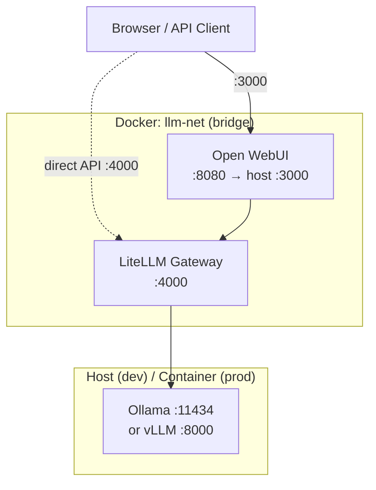

# onprem-llm-stack — 一条命令拉起私有 LLM 推理栈

> 推理层 · API 网关 · Web UI，数据不出内网。

## What this is / who it's for

**Problem:** Enterprise teams want to run capable open-weight LLMs (Qwen, Gemma, …)
internally — without sending prompts to cloud APIs, without rewriting every client
against a new SDK, and without devoting a week to infrastructure glue.

**Solution:** A single `docker compose` invocation starts three collaborating services:

| Layer | Component | Role |
|-------|-----------|------|
| Inference | Ollama (dev) / vLLM (prod) | Loads and serves model weights |
| Gateway | LiteLLM | Auth, model routing, rate-limit (Phase B: per-user budgets) |
| UI | Open WebUI | Chat interface + OpenAI-compatible REST API |

**Key properties:**
- **Air-gapped ready** — all image tags are pinned; no runtime internet dependency.
- **Zero VRAM waste in dev** — the dev profile reuses Ollama already running on the host instead of loading a second copy of the model weights.
- **Drop-in OpenAI compatibility** — any client that speaks `v1/chat/completions` works unchanged; just point `OPENAI_BASE_URL` at `:4000`.

## Architecture

See [`docs/architecture.md`](docs/architecture.md) for the full component diagram.



## Quick start (dev profile)

**Prerequisites:** Docker, Docker Compose v2+, Ollama running on the host with
`qwen3:32b` and/or `gemma4:31b` already pulled.

**One-time host setup (Linux only):** Ollama must listen on `0.0.0.0` so the LiteLLM
container can reach it. By default Ollama binds to `127.0.0.1` only.

```bash
# Run once; requires sudo. Creates a systemd override — does not change the base unit.
sudo mkdir -p /etc/systemd/system/ollama.service.d
printf '[Service]\nEnvironment="OLLAMA_HOST=0.0.0.0:11434"\n' \
  | sudo tee /etc/systemd/system/ollama.service.d/override.conf
sudo systemctl daemon-reload && sudo systemctl restart ollama
```

```bash
# 1. Configure environment (at minimum change LITELLM_MASTER_KEY)
cp .env.example .env && $EDITOR .env

# 2. Start the dev stack (no inference container — uses host Ollama)
docker compose --profile dev up -d

# 3. Verify all services are healthy
bash scripts/healthcheck.sh
```

Once healthy:
- **Web UI:** http://localhost:3000
- **API endpoint:** http://localhost:4000/v1  (use `LITELLM_MASTER_KEY` as Bearer token)

To stop:
```bash
docker compose --profile dev down
```

### Quick API smoke test

```bash
curl http://localhost:4000/v1/chat/completions \
  -H "Authorization: Bearer $LITELLM_MASTER_KEY" \
  -H "Content-Type: application/json" \
  -d '{"model":"qwen3-32b","messages":[{"role":"user","content":"Reply in one word: ready?"}],"max_tokens":5}'
```

## Roadmap

The items below are **intentional Phase A exclusions**, not gaps.
They are planned for later phases:

| Feature | Phase |
|---------|-------|
| Per-user virtual keys + budget enforcement | B |
| Audit log / usage callback to external sink | B |
| PII detection / guardrails (e.g. Presidio) | C |
| SSO / LDAP integration | C |
| Kubernetes manifests (Helm chart) | D |
| Multi-GPU tensor-parallel sharding | D |
| Observability stack (Prometheus · Grafana · Jaeger) | D |
| Automated evaluation / smoke-eval suite | E |

## License

Apache-2.0 © 2026 Elvis Yao. See [LICENSE](LICENSE).
