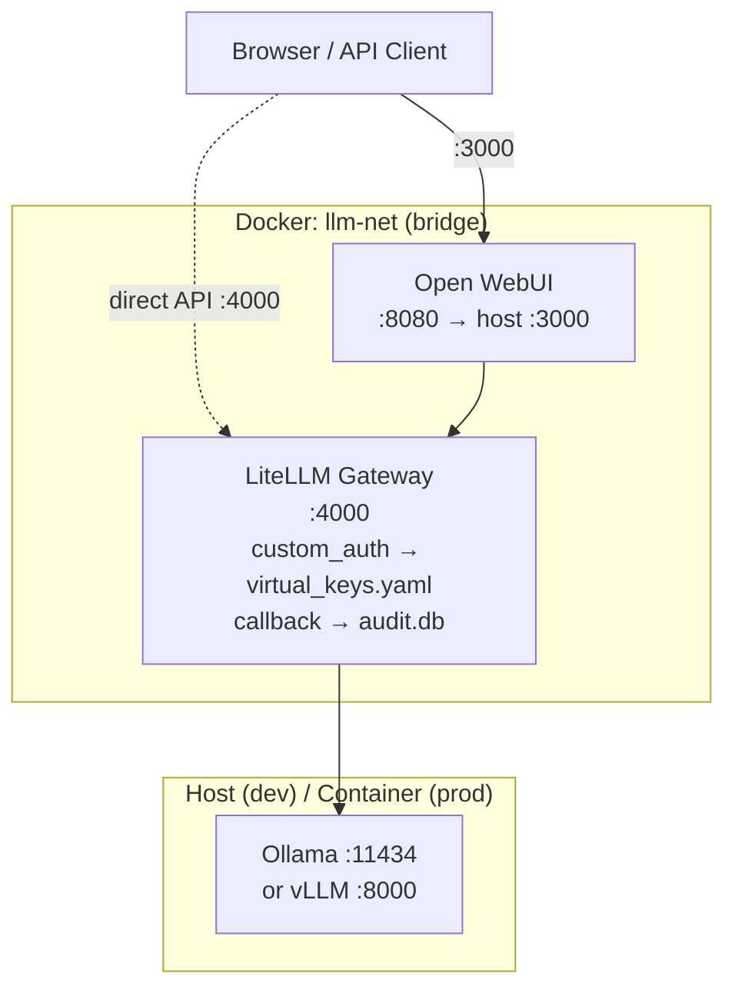

# onprem-llm-stack — 一条命令拉起私有 LLM 推理栈

> 推理层 · API 网关 · Web UI，数据不出内网。

## What this is / who it's for

**Problem:** Enterprise teams want to run capable open-weight LLMs (Qwen, Gemma, …)
internally — without sending prompts to cloud APIs, without rewriting every client
against a new SDK, and without devoting a week to infrastructure glue.

**Solution:** A single `docker compose` invocation starts three collaborating services:

| Layer | Component | Role |
|-------|-----------|------|
| Inference | Ollama (dev) / vLLM (prod) | Loads and serves model weights |
| Gateway | LiteLLM | Auth, model routing, per-user access control |
| UI | Open WebUI | Chat interface + OpenAI-compatible REST API |

**Key properties:**

- **Air-gapped ready** — all image tags are pinned; no runtime internet dependency.
  The audit database is a local SQLite file — including the logs, nothing leaves the box.
- **Per-user access control + local audit trail** — each team member gets their own
  API key scoped to specific models and a spend budget. Every request is logged
  (user, model, tokens, latency) to a local SQLite file. No cloud logging service,
  no Kafka, no external database: data never leaves the box, including the logs.
- **Zero VRAM waste in dev** — the dev profile reuses Ollama already running on the
  host instead of loading a second copy of the model weights.
- **Drop-in OpenAI compatibility** — any client that speaks `v1/chat/completions`
  works unchanged; just point `OPENAI_BASE_URL` at `:4000`.

## Architecture

See [`docs/architecture.md`](docs/architecture.md) for the full component diagram.



## Quick start (dev profile)

**Prerequisites:** Docker, Docker Compose v2+, Ollama running on the host with
`qwen3:32b` and/or `gemma4:31b` already pulled.

**One-time host setup (Linux only):** Ollama must listen on `0.0.0.0` so the LiteLLM
container can reach it. By default Ollama binds to `127.0.0.1` only.

```bash
# Run once; requires sudo. Creates a systemd override — does not change the base unit.
sudo mkdir -p /etc/systemd/system/ollama.service.d
printf '[Service]\nEnvironment="OLLAMA_HOST=0.0.0.0:11434"\n' \
  | sudo tee /etc/systemd/system/ollama.service.d/override.conf
sudo systemctl daemon-reload && sudo systemctl restart ollama
```

```bash
# 1. Configure environment (at minimum change LITELLM_MASTER_KEY)
cp .env.example .env && $EDITOR .env

# 2. Initialise virtual key definitions
cp configs/virtual_keys.yaml.example configs/virtual_keys.yaml

# 3. Start the dev stack
docker compose --profile dev up -d

# 4. Verify all services are healthy
bash scripts/healthcheck.sh
```

Once healthy:
- **Web UI:** http://localhost:3000
- **API endpoint:** http://localhost:4000/v1  (use `LITELLM_MASTER_KEY` as Bearer token)

To stop:
```bash
docker compose --profile dev down
```

### Per-user key management

```bash
# Create a key for alice scoped to qwen3-32b with a $10 budget
bash scripts/create_key.sh --user alice --models qwen3-32b --budget 10 --rpm 60

# Create a key for bob scoped to gemma4-31b
bash scripts/create_key.sh --user bob --models gemma4-31b --budget 5 --rpm 30

# Use alice's key (key printed by create_key.sh)
curl http://localhost:4000/v1/chat/completions \
  -H "Authorization: Bearer <alice-key>" \
  -H "Content-Type: application/json" \
  -d '{"model":"qwen3-32b","messages":[{"role":"user","content":"Hello"}],"max_tokens":512}'
```

### Audit report

```bash
# Per-user aggregated table (all time)
python3 scripts/audit_report.py

# Filter to requests since a date
python3 scripts/audit_report.py --since 2026-06-01
```

### Quick API smoke test (master key)

```bash
curl http://localhost:4000/v1/chat/completions \
  -H "Authorization: Bearer $LITELLM_MASTER_KEY" \
  -H "Content-Type: application/json" \
  -d '{"model":"qwen3-32b","messages":[{"role":"user","content":"Reply in one word: ready?"}],"max_tokens":512}'
```

## Roadmap

| Feature | Phase | Status |
|---------|-------|--------|
| dev/prod profiles, LiteLLM gateway, Open WebUI | A | ✓ done |
| Per-user virtual keys + local audit trail (SQLite) | B | ✓ done |
| PII detection / guardrails | C | planned |
| SSO / LDAP integration | C | planned |
| RPM enforcement | C | planned |
| Kubernetes manifests (Helm chart) | D | planned |
| Multi-GPU tensor-parallel sharding | D | planned |
| Observability stack (Prometheus · Grafana · Jaeger) | D | planned |
| Automated evaluation / smoke-eval suite | E | planned |

## License

Apache-2.0 © 2026 Elvis Yao. See [LICENSE](LICENSE).
