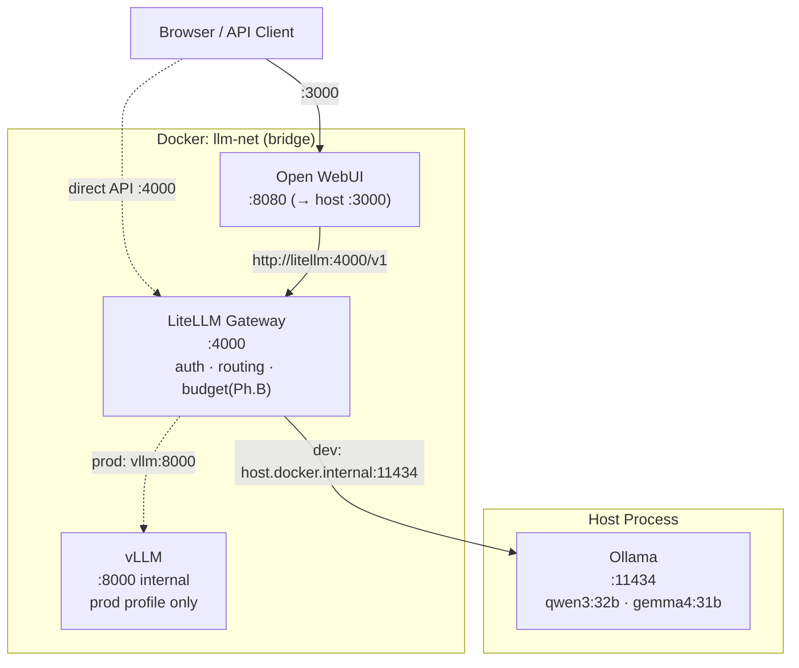

# Architecture

## Component Overview

```
┌──────────────────────────────────────────────────────────────────────┐
│  Host Machine (RTX 5090, 32 GB VRAM)                                 │
│                                                                       │
│  ┌───────────────────────────────────────────────────────────────┐   │
│  │  Docker network: llm-net (bridge)                             │   │
│  │                                                               │   │
│  │  ┌─────────────────┐   HTTP :4000   ┌──────────────────────┐ │   │
│  │  │  Open WebUI     │ ─────────────► │  LiteLLM Gateway     │ │   │
│  │  │  :8080 (→3000)  │               │  :4000               │ │   │
│  │  └─────────────────┘               │  • auth (master_key)  │ │   │
│  │                                    │  • model routing      │ │   │
│  │                                    │  • rate-limit (Ph.B)  │ │   │
│  │                                    └──────────┬───────────┘  │   │
│  └───────────────────────────────────────────────┼───────────────┘   │
│                                                   │                   │
│         dev profile                prod profile   │                   │
│              │                          │         │                   │
│              ▼                          ▼         │                   │
│  ┌────────────────────┐    ┌──────────────────────┴──┐               │
│  │  Ollama (host)     │    │  vLLM container          │               │
│  │  :11434            │    │  :8000 (internal only)   │               │
│  │  qwen3:32b         │    │  custom model via .env   │               │
│  │  gemma4:31b        │    └─────────────────────────┘               │
│  └────────────────────┘                                               │
│                                                                       │
│  ┌───────────────────────────────────────────┐                        │
│  │  External access (host ports only)         │                        │
│  │  :3000  → Open WebUI (browser)             │                        │
│  │  :4000  → LiteLLM API (curl / SDK)         │                        │
│  └───────────────────────────────────────────┘                        │
└──────────────────────────────────────────────────────────────────────┘
```

## Mermaid Diagram



## Data Flow

1. **Request enters** through Open WebUI (browser) or directly via the LiteLLM API (`:4000`).
2. **LiteLLM authenticates** the request with the master key (Phase B adds per-user virtual keys).
3. **LiteLLM routes** to the appropriate backend based on the `model` field in the request:
   - `qwen3-32b` → Ollama on `host.docker.internal:11434` (dev)
   - `gemma4-31b` → Ollama on `host.docker.internal:11434` (dev)
   - `vllm-default` → vLLM container on `vllm:8000` (prod, uncomment in config)
4. **Response streams back** through LiteLLM to the caller.

## Profile comparison

| Dimension        | dev (Ollama)                     | prod (vLLM)                          |
|-----------------|----------------------------------|--------------------------------------|
| Inference        | Ollama host process              | vLLM Docker container                |
| VRAM usage       | One copy of weights on host      | One copy of weights in container     |
| Startup time     | Instant (Ollama already loaded)  | Slow (model load on container start) |
| Throughput       | Single-stream, moderate          | Continuous batching, high            |
| Model hot-swap   | `ollama pull` + config change    | Restart container + VLLM_MODEL       |
| Use case         | Local development, exploration   | Staging, production, multi-user      |

## Port reference

| Service   | Container port | Default host port | Configurable via   |
|-----------|---------------|-------------------|--------------------|
| Open WebUI | 8080          | 3000              | `WEBUI_PORT`       |
| LiteLLM   | 4000          | 4000              | `LITELLM_PORT`     |
| vLLM      | 8000          | not exposed       | internal only      |
| Ollama    | 11434         | 11434             | host process       |

## Phase roadmap

```
Phase A (current) — inference + gateway + WebUI
Phase B           — virtual keys, per-user budgets, audit callback
Phase C           — PII guardrails, prompt injection detection, SSO/LDAP
Phase D           — Kubernetes, multi-GPU, observability stack (Prometheus/Grafana)
```
